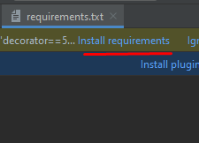

## Descrição

O Jogo dos 15 é representado por uma matriz 4x4 onde há 15 células numeradas e uma célula em
branco. Variações deste Jogo podem conter parte de uma imagem em cada célula. O problema consiste
em partir de uma configuração inicial embaralhada das células e chegar a uma configuração final com
uma ordenação determinada de algarismos (no caso da matriz de números) ou de imagens (no caso da
matriz onde as células representam partes de uma imagem). Os movimentos/operadores possíveis para
se chegar de uma configuração a outra são: 1) mover a célula em branco para cima, 2) mover a célula
em branco para baixo, 3) mover a célula em branco para a direita e 4) mover a célula em branco para a
esquerda.

 

* #### ENTRADA INICIAL UM 

| 1   | 2   | 3   | 4   |   
|-----|-----|-----|-----|
| 5   | 6   | 8   | 12  |
| 13  | 9   | 0   | 7   |
| 14  | 11  | 10  | 15  |

 

* #### ENTRADA INICIAL DOIS 

| 1   | 2   | 3   | 4   |
|-----|-----|-----|-----|
| 13  | 6   | 8   | 12  |
| 5   | 9   | 0   | 7   |
| 14  | 11  | 10  | 15  |

 

*  REPRESENTAÇÃO DO ESTADOS INICIAIS SOLICITADOS NO TRABALHO

 

| 1   | 2   | 3   | 4   |
|-----|-----|-----|-----|
| 5   | 6   | 7   | 8   |
| 9   | 10  | 11  | 12  |
| 13  | 14  | 15  | 0   |
 

* REPRESENTAÇÃO DO ESTADO FINAL
 

## Como executar no PyCharm

<!-- TOC -->
  * Abra esse projeto em um ambiente virtual

  * Vá no arquivo requirements.txt e click em 'Install requirements' ou Execute no terminal: pip install -r requirements.txt 

<!-- TOC -->

&nbsp;&nbsp;&nbsp;&nbsp;&nbsp;&nbsp;&nbsp;&nbsp;

Após isso, para executar qualquer algoritmo utilizando o PyCharm, entre na pasta algoritmos clique com o botão direito e selecione 
"Run 'Algoritmo_Escolhido' " após isso, selecione qual das sua entradas deseja usar (UM OU DOIS)

* Pasta: /algoritmos

| Algoritmo             | Arquivo               |
| --------------------- |-----------------------|
| Busca em largura      | Busca_Largura.py      |
| Busca em profundidade | Busca_Profundidade.py |
| Busca Gulosa          | Busca_Gulosa .py      |
| A\*                   | AEstrela.py          |

